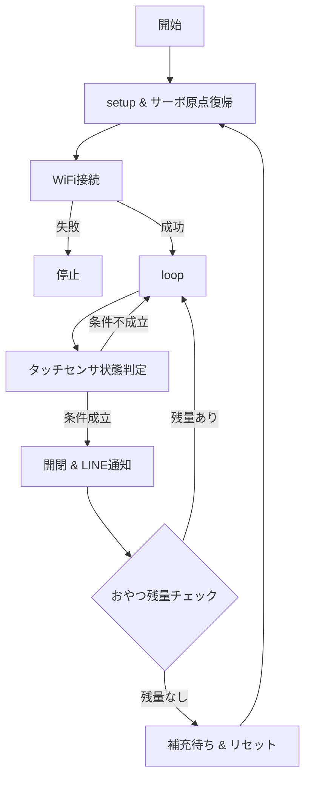

# automatic-cat-treat-dispenser

# 概要
卒業制作で自動おやつディスペンサーを作成

[排出動画](https://github.com/user-attachments/assets/c99220cf-aa28-45f3-878d-1a4b46926cdf)

# 機能

1.タッチセンサ入力
 ・センサに触れると機械が反応し、排出動作を開始

 2．サーボゲート開閉
  ・サーボモーターがゲートを開閉し、おやつを排出

3.排出回数カウント
  ・排出回数を排出ごとにカウントを1増やす
  ・在庫は排出可能回数で管理

4.LINE通知
  ・排出時：猫がタッチセンサを触ったこと・残りの排出回数を通知

5.在庫なし判定
  ・カウントが可能排出回数と同じになれば機械が停止
  ・LINEにおやつが少なくなっていることを通知

6.リセット
  ・おやつを補充する
  ・補充後、マイコンのリセットボタンを押してリセット

# 使用モジュール
|部品|個数|用途|接続ピン|
|:---:|:---:|:---:|:---:|
|Arduino UNO R4 WiFi|1|通信・制御|USBケーブル|
|タッチセンサ（TTP223B）|1|手動給餌トリガー|D2|
|サーボモータ(9G Servo)|1|- フラップゲートの開閉制御|D9|
|Breadboard Power Module with Battery|1|電源供給の安定化|ブレッドボード|

# 使用ライブラリ（ソフトウェア）
・WiFiS3.h

　→Arduino UNO R4 WiFi向けのWi-Fi制御ライブラリ（追加ライブラリ）

・ArduinoHttpClient.h

　→HTTP/HTTPS 通信を行うためのクライアントライブラリ（追加ライブラリ）
 
・Servo.h

 　→サーボモータを制御するためのライブラリ（標準ライブラリ）
  
・arduino_secrets.h

　→WiFi SSIDやパスワードなど秘密情報を記述するためのヘッダーファイル

# 配線図
※Breadboard Power Module with Batteryを実機には取り付けている
  

# 回路図

# 動作仕様書

# 自動おやつディスペンサーの仕様

1.段ボールに埋め込まれたTouch Sensorをタッチ

2.サーボでゲートを開閉して排出

3.LINE通知

# 工夫点

### 通知メッセージのメモリ管理

 ・String クラスではなく char[] の固定長バッファを使用し、ヒープ断片化を防止
 
 ・snprintf を利用してバッファサイズを超えないように制御し、バッファオーバーフローを防止
 
 ・これによりメモリ効率と安定性を向上

### 英語通知の採用

 ・日本語よりもバイト数が少なく、通信負荷を軽減
 
### WiFi接続の再チェック

 ・LINE通知前に必ず接続確認を行い、失敗時は再試行し、通信の信頼性を高める

### おやつ残量チェック

 ・残量がない場合は「補充待ち状態」に移行し、無駄な通知や誤動作を防ぐ

# 応用点（追加したい機能）

・排出時にカメラで写真を撮り、LINEにメッセージと同時に送る

・定時になればおやつが排出するプログラム

・物理的にタッチセンサに触れやすいように改良する

・小型ロードセルを排出容器に取り付けて残量を確認できるようにする

# 使用ツール

### Messaging API

公式サイト

[LINE公式アカウント作成](https://entry.line.biz/start/jp/)

[Messaging API](https://developers.line.biz/ja/docs/messaging-api/pricing/)

Messaging APIとは

LINE公式アカウントと外部サービスをつなぎ、双方向のコミュニケーションを可能にする仕組み

毎月200通までなら無料でコミュニケーションが取れる
 
# 参考サイト

[基本プロジェクト：サーボ](https://docs.sunfounder.com/projects/elite-explorer-kit/ja/latest/basic_projects/27_basic_servo.html)

[WiFi接続方法参考](https://docs.sunfounder.com/projects/elite-explorer-kit/ja/latest/iot_projects/00_iot_project.html)
