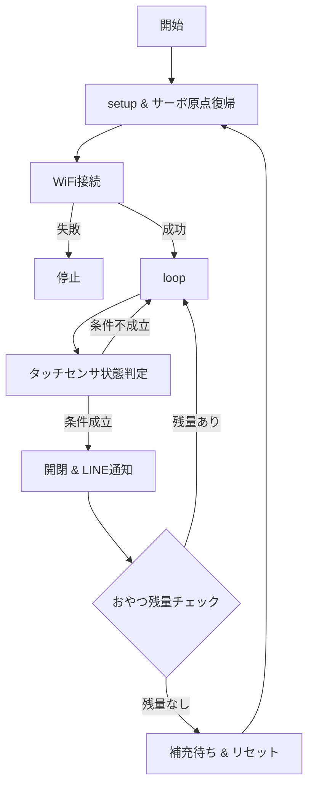

# automatic-cat-treat-dispenser

# 概要
卒業制作で自動おやつディスペンサーを作成

# 機能
・タッチセンサで触れたらおやつを排出する

・タッチセンサの出力がHIGHになればサーボモーターでゲートを開閉する

・おやつが排出されたら、LINEでタッチされたことと残りのおやつ排出回数を通知させる

・残りのおやつ排出回数が０になればLINEで補充通知と補充＆マイコンでリセットボタンを押すまで停止

# 使用モジュール
|部品|個数|用途|接続ピン|
|:---:|:---:|:---:|:---:|
|Arduino UNO R4 WiFi|1|通信・制御|USBケーブル|
|タッチセンサ（TTP223B）|1|手動給餌トリガー|D2|
|サーボモータ(9G Servo)|1|- フラップゲートの開閉制御|D9|
|Breadboard Power Module with Battery|1|電源供給の安定化|ブレッドボード|

# 使用ライブラリ（ソフトウェア）
・WiFiS3.h

　→Arduino UNO R4 WiFi向けのWi-Fi制御ライブラリ（追加ライブラリ）

・ArduinoHttpClient.h

　→HTTP/HTTPS 通信を行うためのクライアントライブラリ（追加ライブラリ）
 
・Servo.h

 　→サーボモータを制御するためのライブラリ（標準ライブラリ）
  
・arduino_secrets.h

　→WiFi SSIDやパスワードなど秘密情報を記述するためのヘッダーファイル

# 配線図
※Breadboard Power Module with Batteryを実機には取り付けている
  

# 回路図

# 動作仕様書

# 工夫点

### 通知メッセージのメモリ管理

 ・String クラスではなく char[] の固定長バッファを使用し、ヒープ断片化を防止
 
 ・snprintf を利用してバッファサイズを超えないように制御し、バッファオーバーフローを防止
 
 ・これによりメモリ効率と安定性を向上

### 英語通知の採用

 ・日本語よりもバイト数が少なく、通信負荷を軽減
 
### WiFi接続の再チェック

 ・LINE通知前に必ず接続確認を行い、失敗時は再試行し、通信の信頼性を高める

### おやつ残量チェック

 ・残量がない場合は「補充待ち状態」に移行し、無駄な通知や誤動作を防ぐ
 
# 参考サイト

[基本プロジェクト：サーボ](https://docs.sunfounder.com/projects/elite-explorer-kit/ja/latest/basic_projects/27_basic_servo.html)

[WiFi接続方法参考](https://docs.sunfounder.com/projects/elite-explorer-kit/ja/latest/iot_projects/00_iot_project.html)
