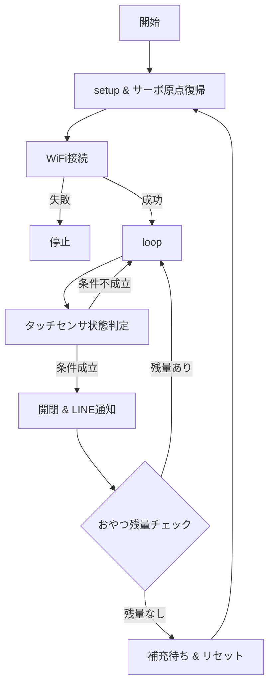

# automatic-cat-treat-dispenser

# 概要
卒業制作で自動おやつディスペンサーを作成

# 機能
・タッチセンサで触れたらおやつを排出する

・タッチセンサの出力がHIGHになればサーボモーターでゲートを開閉する

・おやつが排出されたら、LINEでタッチされたことと残りのおやつ排出回数を通知させる

・残りのおやつ排出回数が０になればLINEで補充通知と補充＆マイコンでリセットボタンを押すまで停止

# 使用モジュール
|部品|個数|用途|接続ピン|
|:---:|:---:|:---:|:---:|
|Arduino UNO R4 WiFi|1|通信・制御|USBケーブル|
|タッチセンサ（TTP223B）|1|手動給餌トリガー|D2|
|サーボモータ(9G Servo)|1|- フラップゲートの開閉制御|D9|
|Breadboard Power Module with Battery|1|電源供給の安定化|ブレッドボード|

# 使用ライブラリ（ソフトウェア）
・WiFiS3.h

　→Arduino UNO R4 WiFi向けのWi-Fi制御ライブラリ

・ArduinoHttpClient.h

　→‣HTTP/HTTPSリクエストを簡単に送るためのライブラリ
 
・Servo.h

 　→Arduino標準ライブラリのひとつで、サーボモータを簡単に制御するためのヘッダファイル
  
・arduino_secrets.h

　→WiFi接続

# 配線図
※Breadboard Power Module with Batteryを実機には取り付けている
  

# 回路図

# 動作仕様書

# 参考サイト

[基本プロジェクト：サーボ](https://docs.sunfounder.com/projects/elite-explorer-kit/ja/latest/basic_projects/27_basic_servo.html)

[WiFi接続方法参考](https://docs.sunfounder.com/projects/elite-explorer-kit/ja/latest/iot_projects/00_iot_project.html)
